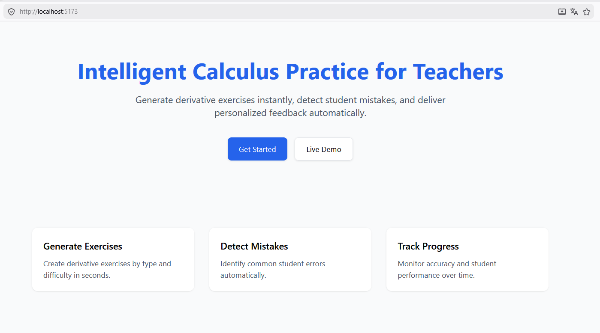

# DerivaLab

DerivaLab is a Full-Stack Micro-SaaS designed to help high school calculus teachers generate exercises, evaluate student answers, and provide automated feedback.

## Problem

Teachers spend excessive time:

- Creating calculus exercises
- Reviewing answers manually
- Providing personalized feedback

## Solution

DerivaLab automates:

- Exercise generation
- Answer validation
- Feedback generation

## Tech Stack

- Frontend: React
- Backend: Node.js + Express
- Database: PostgreSQL
- Authentication: JWT + bcryptjs

## Project Status

In development (MVP phase)

## Database Setup

The PostgreSQL schema is located in:

```bash
server/database/schema.sql
```

## Testing

Manual and integration testing documented in docs/testing.md, including backend validation and frontend integration checks.

## License

This project is licensed under the MIT License.

## Author

Luis Alvarez
