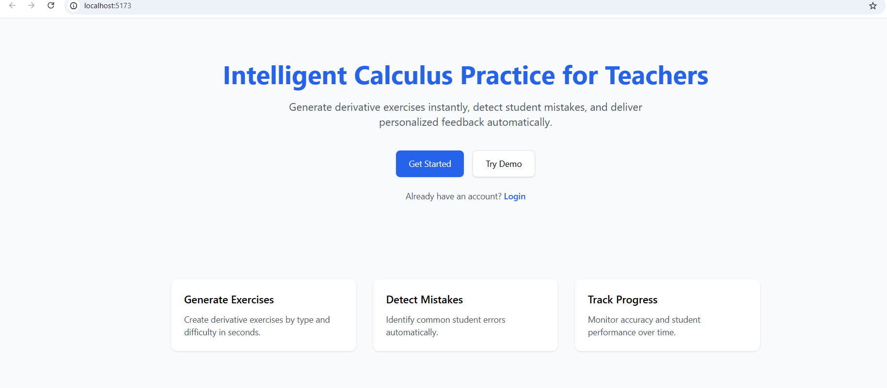

# DerivaLab

DerivaLab is a full-stack web application that helps high school calculus teachers generate derivative exercises, validate student answers, provide automated feedback, and monitor learning progress through interactive dashboards.

The project was built as my main portfolio application to practice modern frontend and backend development while following clean architecture, reusable components, REST API design, authentication, and secure coding practices.

---

## Project Overview

Teaching calculus usually requires repetitive work such as creating exercises, reviewing answers, calculating student accuracy, and identifying common mistakes.

DerivaLab automates these repetitive tasks so teachers can spend more time helping students understand mathematical concepts.

The application includes complete teacher and student workflows connected through a REST API and a PostgreSQL database.

---

## Features

Current MVP functionality includes:

### Teacher

- Secure authentication with JWT
- Dashboard with learning statistics
- Student management
- Individual student analytics
- Learning accuracy chart
- Common error analysis
- Exercise difficulty distribution
- Student practice history

### Student

- Secure authentication
- Practice derivative exercises
- Automatic answer validation
- Intelligent feedback
- Personal learning dashboard
- Practice history
- Accuracy statistics

### Demo Experience

The application includes demo accounts that allow recruiters to explore the complete application without creating an account.

---

## Tech Stack

### Frontend

- React
- React Router
- Axios
- Recharts
- Tailwind CSS
- Vite

### Backend

- Node.js
- Express
- PostgreSQL
- JWT Authentication
- bcryptjs
- Helmet

### Database

- PostgreSQL

Prepared for production deployment using Neon PostgreSQL.

---

## Architecture

DerivaLab follows a classic client-server architecture.

```text
React Frontend
       │
       │ REST API
       ▼
Node.js + Express
       │
       ▼
PostgreSQL
```

This separation keeps the frontend, backend, and database independent, making the project easier to maintain, test, and deploy.

---

## Project Goals

This project was created to demonstrate practical knowledge of:

- React component architecture
- REST API integration
- Authentication with JWT
- PostgreSQL database design
- Secure backend development
- Dashboard development with charts
- Clean and maintainable code
- Real-world project organization

---

# Quick Start

## 1. Clone the repository

```bash
git clone https://github.com/your-username/derivalab.git

cd derivalab
```

---

## 2. Install dependencies

### Backend

```bash
cd server

npm install
```

### Frontend

```bash
cd ../client

npm install
```

---

## 3. Configure environment variables

Create the following files:

```text
server/.env
client/.env
```

Use the provided example files as a reference:

```text
server/.env.example
client/.env.example
```

---

## 4. Create the database

Run the PostgreSQL schema located in:

```text
server/database/schema.sql
```

Optional demo data:

```text
server/database/demo_users.sql
server/database/demo_history.sql
```

---

## 5. Start the application

### Backend

```bash
cd server

npm run dev
```

Runs on:

```text
http://localhost:3000
```

### Frontend

```bash
cd client

npm run dev
```

Runs on:

```text
http://localhost:5173
```

---

## Project Structure

```text
DerivaLab
│
├── client/
│   ├── src/
│   ├── public/
│   └── package.json
│
├── server/
│   ├── src/
│   ├── database/
│   ├── .env.example
│   └── package.json
│
├── docs/
│
└── README.md
```

---

## Demo Experience

DerivaLab includes demo accounts so recruiters can explore the application without creating new users.

### Teacher Demo

**Email**

```text
demo.teacher@derivalab.com
```

Features available:

- Teacher Dashboard
- Student Analytics
- Accuracy Chart
- Error Analysis
- Difficulty Distribution
- Student History

### Student Demo

The student demo login is performed automatically from the application.

Features available:

- Practice Exercises
- Automatic Feedback
- Learning Statistics
- Practice History

---

## Documentation

Additional technical documentation is available in the `docs/` directory.

- `architecture.md`
- `backend.md`
- `frontend.md`
- `testing.md`

---

## Environment Variables

Configuration examples are included in:

```text
server/.env.example
client/.env.example
```

No secrets are stored in this repository.

---

## Database

Database schema:

```text
server/database/schema.sql
```

Optional demo data:

```text
server/database/demo_users.sql
server/database/demo_history.sql
```

## Documentation

Additional technical documentation is available in the `docs/` folder.

| Document          | Description                                           |
| ----------------- | ----------------------------------------------------- |
| `architecture.md` | Overall application architecture and design decisions |
| `backend.md`      | Backend structure, API layers and services            |
| `frontend.md`     | Frontend architecture and component organization      |
| `testing.md`      | Manual testing process and validation results         |

---

## Deployment

The project is prepared for cloud deployment using a separated architecture.

| Service  | Platform        |
| -------- | --------------- |
| Frontend | Vercel          |
| Backend  | Koyeb           |
| Database | Neon PostgreSQL |

Production deployment is currently in progress.

---

## Roadmap

Future improvements planned for DerivaLab include:

- More derivative exercise generators
- Additional calculus topics
- Teacher classroom management
- Student progress reports
- Exportable analytics
- Automated grading reports

---

## License

This project is licensed under the **MIT License**.

---

## Author

**Luis Alvarez**
