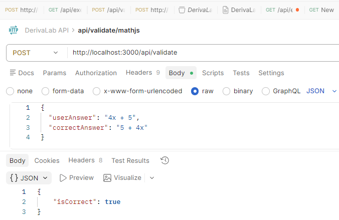
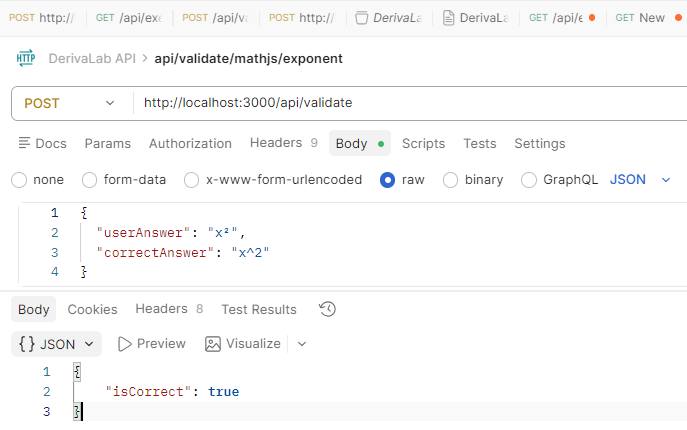
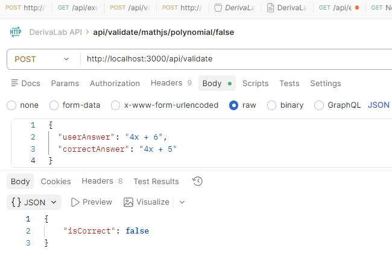

# Testing – DerivaLab

This document describes the manual testing performed during my journey creating Derivalab.

## Overview

The goal is to validate the basic functionality of the system, including:

- Backend server availability
- API endpoint response
- Frontend-backend integration

## Backend Testing

### Endpoint: GET /api/health

**Method:**

- Browser

```
http://localhost:3000/api/health
```

**Expected Response:**

```
{
  "status": "ok",
  "message": "Server is running"
}
```

**Result:**
Success — endpoint responds correctly

## Frontend Testing

### Application Load

**URL:**

```
http://localhost:5173
```

**Expected Behavior:**

- Page renders without errors
- Displays application title
- Displays message from backend

**Expected Output:**

```
DerivaLab
Server message: Server is running
```

**Result:**
Success — frontend renders and fetches data correctly

## Testing-Integration

### Flow

Frontend → Axios → Backend → JSON Response → UI Render

**Validated:**

- API communication works
- Data is correctly received and displayed

**Result:**
Success — full integration working


## Conclusion

The system is functional at a basic level, the backend API is operational, the frontend is correctly connected anddata flow between client and server is validated establishing a solid foundation for further feature development.

---

## Exercise Generation Testing

### 1. Backend Endpoint Test

**Endpoint:**
GET /api/exercises

**Method:**
Browser and curl

**Steps:**

1. Start server:

   ```
   cd server
   npm run dev
   ```

2. Open:

   ```
   http://localhost:3000/api/exercises
   ```

3. Alternative (terminal):
   ```
   curl http://localhost:3000/api/exercises
   ```

**Expected Response:**

- JSON object
- Contains:
  - question
  - answer

Example:

```
{
  "question": "f(x) = 3x^2 + 4x",
  "answer": "f'(x) = 6x + 4"
}
```

**Evidence:**


**Result:**
Endpoint returns valid and random derivative exercises

### 2. Frontend Integration Test

**URL:**
http://localhost:5173

**Steps:**

1. Start frontend:

   ```
   cd client
   npm run dev
   ```

2. Open application in browser

3. Verify:
   - Exercise is displayed
   - Answer is displayed
   - Button generates new exercise

**Expected Behavior:**

- UI renders without errors
- Clicking "Generate New" updates exercise

**Evidence:**


**Result:**
Frontend successfully fetches and displays exercises from backend

### 3. Integration Flow Test

**Flow:**

Frontend → Axios → Backend → Service → Response → UI

**Validated:**

- API communication works
- Data is correctly transferred
- UI updates dynamically

**Result:**
Full-stack integration working correctly

---

## Answer Validation Testing

### 1. Backend Validation Test

**Endpoint:**
POST /api/validate

**Tool:**
Postman

**Test Correct Answer**

Request:

```json
{
  "userAnswer": "4x+5",
  "correctAnswer": "4x + 5"
}
```

Expected:

```json
{
  "isCorrect": true
}
```

Result:
Passed


### 2. Frontend Interaction Test

**Steps:**

1. Open app at http://localhost:5173
2. Enter correct answer
3. Click "Check Answer"

**Expected:**

- Displays "Correct answer"

**Result:**
Passed


**Steps:**

1. Enter incorrect answer
2. Click "Check Answer"

**Expected:**

- Displays "Try again"

**Result:**
Passed

**Evidence:**


### 3. Full Integration Test

**Flow:**
Frontend → POST /api/validate → Backend → Response → UI

**Validated:**

- Data sent correctly
- Backend processes correctly
- UI updates dynamically

**Result:**
Passed

- Verified using Postman and browser

---

## Advanced Exercise System Testing

### Backend

Tested:

- polynomial / easy
- power / medium
- trig / easy

### API

GET /api/exercises?type=polynomial&difficulty=easy

Returns structured response with metadata


GET /api/exercises?type=power&difficulty=medium

Returns structured response with metadata


GET /api/exercises?type=trig&difficulty=easy

Returns structured response with metadata


### Frontend

- User selects type
- User selects difficulty
- Exercise updates automatically

Result:
UI reacts correctly to user input

### Selects Trigonometric


### Selects hard


### Updates automatically


### Integration

- Frontend sends query params
- Backend processes correctly

Result:
Full dynamic system working


---

## Mathematical Validation Testing

### Backend Validation

Tested with:

- equivalent expressions (4x + 5 vs 5 + 4x)



- power notation (x² vs x^2)



- incorrect answers



Result:
Mathematical comparison and normalization handles variations correctly

### Integration

- Frontend sends answer
- Backend validates using mathjs

Result:
Reliable validation achieved

---

## Feedback System (Integrated with mathjs)

### Validation Layer

- Mathematical equivalence using mathjs
- Handles expression variations

Result:
Accurate validation independent of formatting

### Feedback Layer

Tested:

- Missing coefficient
- Sign errors
- Chain rule mistakes
- Trigonometric confusion

Result:
Contextual feedback generated

### Integration

Flow:
Frontend → /api/feedback → validation → feedback → UI

Result:
Full intelligent feedback loop working

---

## Authentication Tests

### Login with correct credentials

I tested the login route using a valid email and password.

Expected:
The server should validate the credentials and return a JWT token.

Actual result:
The login was successful and the token was returned correctly.

### Password hashing

I verified that the password is hashed before being stored.

Expected:
The stored password should not match the plain text password.

Actual result:
The password was stored as a bcrypt hash, not as plain text.

### JWT token generation

I verified that a token is created after successful login.

Expected:
The server should generate and return a valid JWT token.

Actual result:
The JWT token was generated and returned correctly after login.
