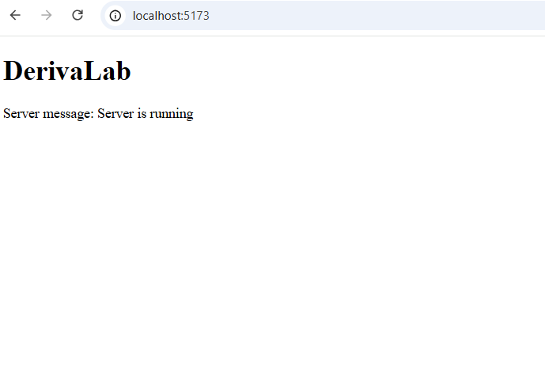
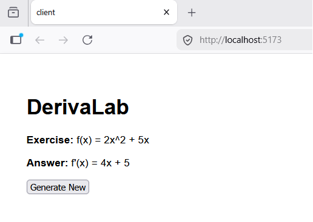

# Testing – DerivaLab

## Overview

This document summarizes the manual testing performed during the development of DerivaLab.

The goal is to verify that the main user workflows, API endpoints, authentication, dashboards, and security features behave as expected.

---

## Testing Strategy

The project was tested from three different perspectives:

- Backend endpoint validation
- Frontend integration
- Complete user workflows

Whenever possible, features were verified through the complete application flow instead of testing isolated functions only.

---

# Health Check

## Endpoint

```
GET /api/health
```

### Verified

- Server starts correctly
- API responds successfully
- JSON response format

### Result

Passed



---

# Authentication

## Registration

Verified:

- Teacher registration
- Student registration
- Email validation
- Minimum password length
- Password hashing

### Result

Passed

---

## Login

Verified:

- Valid credentials
- Invalid credentials
- JWT generation
- Protected route access

### Result

Passed

---

# Exercise Generation

Verified:

- Polynomial exercises
- Power rule exercises
- Trigonometric exercises
- Difficulty selection
- Random exercise generation

### Result

Passed



---

# Mathematical Validation

Verified:

- Equivalent expressions

Example:

```
4x + 5

5 + 4x
```

- Different exponent notation

```
x²

x^2
```

- Incorrect answers

### Result

Passed

---

# Feedback Engine

Verified:

- Correct answers
- Incorrect answers
- Error classification
- Contextual feedback generation

### Result

Passed

---

# Student Dashboard

Verified:

- Statistics update correctly
- Practice history
- Learning progress
- Accuracy values
- Dashboard refresh after new attempts

### Result

Passed

---

# Teacher Dashboard

Verified:

- Student list
- Overall statistics
- Accuracy chart
- Error distribution
- Difficulty distribution
- Individual student analytics

Special attention was given to validating accuracy calculations after multiple rapid practice attempts.

### Result

Passed

---

# Demo Experience

Verified:

- Demo Teacher login
- Demo Student login
- Automatic demo access
- Demo dashboards
- Demo analytics

The demo environment remains isolated from registered users.

### Result

Passed

---

# API Integration

Communication flow verified:

```
React

↓

Axios

↓

Express API

↓

PostgreSQL

↓

JSON Response

↓

React UI
```

Verified:

- Successful requests
- Error responses
- Dashboard data loading
- Practice workflow

### Result

Passed

---

# Environment Configuration

Verified:

- Local environment variables
- Backend configuration through `.env`
- Frontend configuration through `VITE_API_URL`
- Production-ready configuration without hardcoded API URLs

### Result

Passed

---

# Security Validation

The following security features were manually verified.

## JWT Authentication

- Protected routes require authentication.
- Unauthorized requests are rejected.

## Password Protection

- Passwords are stored using bcrypt hashes.

## SQL Injection Protection

- Database queries use parameterized PostgreSQL statements.

## Input Validation

Verified:

- Email format
- Minimum password length

## HTTP Security

Verified:

- Helmet security headers
- JSON body size limit

### Result

Passed

---

# Future Improvements

Possible future enhancements include:

- Automated API testing
- Unit testing
- Component testing
- End-to-end testing
- CI pipeline integration

---

# Conclusion

Manual testing confirmed that the main application workflows operate correctly.

The project currently validates:

- Authentication
- Exercise generation
- Mathematical validation
- Feedback generation
- Teacher dashboard
- Student dashboard
- Demo experience
- REST API integration
- Basic security measures
